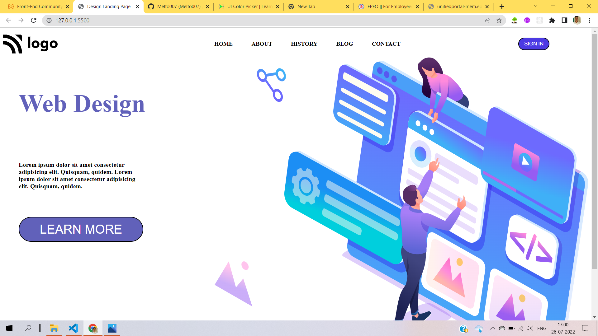

# Hi I'm Aravind

I built this project using below `tech stack`

- HTML5
- CSS3
  - I used Flexbox to align `div` containers inside body of html document
  - I used linear-gradient property of css3 to give two different color to buttons and background
  - I used position relative and absolute to align div elements and images

> Here's the glimpse pic of the landing page

live-link : [web-design-landing-page](https://web-design-page-project-08.netlify.app/)
